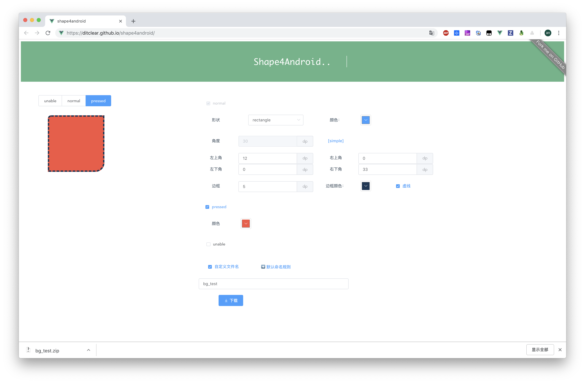

# shape4android
> 使用Vue快速生成Android的背景xml
>
> 免去手动重复创建多个android xml文件的烦恼，可自定义名称

#### Feature

- 快速生成
- 可视化操作
- 可自定义文件名称

在线体验：https://ditclear.github.io/shape4android/

#### 截图：

#### 默认命名规则

shape： `shape_type_color_roundTL_roundTR_roundBL_roundBR_borderWidth_borderColor.xml`  

selector：`selector_shape_n_color_p_pressedColor_u_unableColor.xml`

> PS:如果自定义名称，那么selector中的shape默认会跟上type名，比如xx_norm.xml/xx_pressed.xml/xx_unable.xml

#### License

The MIT License